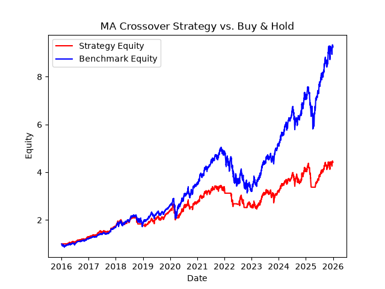
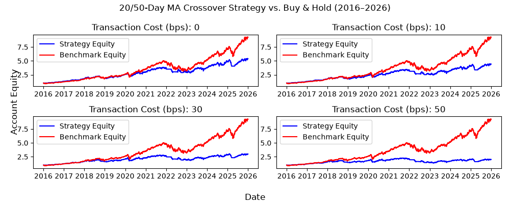
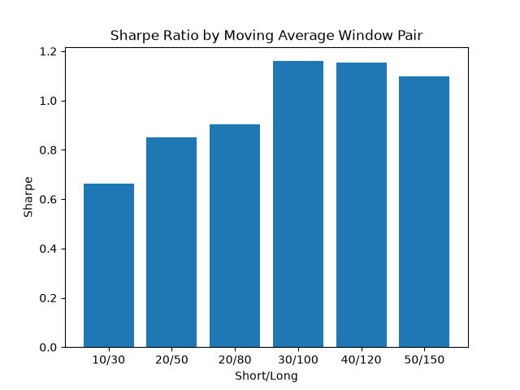
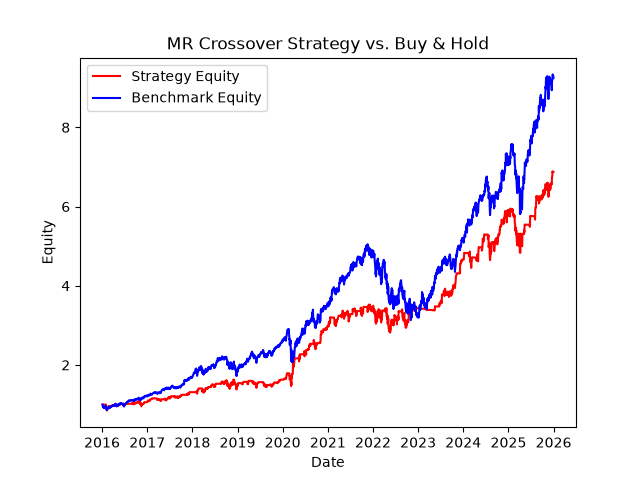

# Momentum & Mean-Reversion Backtesting Engine

A from-scratch backtesting engine built to rigorously test two classic trading
strategies — moving-average momentum and z-score mean-reversion — with a
specific focus on avoiding the mistakes that make backtests lie: lookahead
bias, ignored transaction costs, and untested parameter choices.

**Universe:** MSFT, AMZN, JPM, GOOGL | **Period:** 2016–2026 | **Language:** Python (pandas, numpy, matplotlib)

## Key finding

The moving-average strategy trades off return for safety: it underperforms
buy-and-hold on raw returns during this sustained bull market (16.1% vs 25.0%
annualized), but delivers meaningfully better downside protection (-28.7% max
drawdown vs -37.9%). This trade-off — and how fragile it is to transaction
costs and parameter choice — is the real subject of this project, not "beating
the market."

## Results: Moving Average (20/50) vs Buy & Hold

| Metric | Strategy | Benchmark |
|---|---|---|
| Total return | 342% | 823% |
| Annualized return | 16.1% | 25.0% |
| Sharpe ratio | 0.95 | 1.07 |
| Max drawdown | -28.7% | -37.9% |



## Why the one-day execution lag matters

A signal computed from today's closing price can't be traded until tomorrow —
you don't know today's close until the market closes. Skipping this lag
("lookahead bias") is the single most common way backtests overstate
performance. On test data, removing the lag inflated total returns from
**~125% to ~310%** for the *identical* strategy and dataset — the only
difference was letting the simulation illegally see the future by one day.
Catching and correctly implementing this lag (`signal.shift(1)`) was the main
engineering focus of `backtest.py`.

## Stress test 1: transaction cost sensitivity

Real trading isn't free. Running the same strategy at increasing cost
assumptions shows the edge is fragile, not robust:

| Cost (bps) | Total Return | Sharpe | Max Drawdown |
|---|---|---|---|
| 0 | 438% | 0.95 | -26.2% |
| 10 | 342% | 0.85 | -28.7% |
| 30 | 199% | 0.65 | -34.1% |
| 50 | 101% | 0.45 | -39.6% |



Sharpe more than halves (0.95 → 0.45) as costs rise from 0 to 50 bps —
evidence the strategy's apparent edge depends heavily on trading cheaply,
a real constraint any live implementation would have to take seriously.

## Stress test 2: parameter robustness

To check the 20/50-day window wasn't a lucky, cherry-picked pair, the same
strategy was re-run across six window combinations:

| Short/Long | Sharpe | Total Return | Max Drawdown |
|---|---|---|---|
| 10/30 | 0.66 | 200% | -52.7% |
| 20/50 | 0.85 | 342% | -28.7% |
| 20/80 | 0.90 | 396% | -45.2% |
| 30/100 | 1.16 | 727% | -29.8% |
| 40/120 | 1.15 | 791% | -27.9% |
| 50/150 | 1.10 | 674% | -28.7% |



Sharpe stays positive across every pair (0.66–1.16), with longer windows
outperforming shorter ones — consistent with short windows reacting to price
noise and racking up whipsaw trading costs. The strategy's edge appears
structural rather than a one-off artifact of a single lucky parameter choice.

## Strategy comparison: momentum vs mean-reversion

A second, structurally different strategy (z-score mean-reversion, with
stateful hold logic between entry/exit thresholds) was implemented and run
through the identical pipeline for a fair comparison:

| Strategy | Sharpe | Total Return | Max Drawdown |
|---|---|---|---|
| Moving Average (momentum) | 0.85 | 342% | -28.7% |
| Mean Reversion | 0.68 | 253% | -29.9% |



Momentum outperformed mean-reversion here, consistent with the sustained
bull-market conditions in these four tickers over 2016–2026 — momentum
strategies are built to ride trends, while mean-reversion strategies are
generally better suited to range-bound, sideways markets, which this period
largely wasn't. This is a regime-dependence finding, not evidence that one
strategy is unconditionally "better."

## Risk management: drawdown circuit breaker

An optional overlay forces the strategy fully into cash whenever it's drawn
down more than a specified limit (e.g. -20%) from its peak equity, resuming
normal trading once the drawdown recovers within that limit.

**Implementation note:** the breaker's trigger is computed from the
*unrestricted* equity curve (as if the breaker didn't exist), not the actual
equity curve that results once positions start being clamped. This is a
simplifying approximation, not a fully self-consistent walk-forward
simulation — a genuine limitation, noted here rather than hidden.

| | Total Return | Max Drawdown | Sharpe |
|---|---|---|---|
| Without breaker | 342.0% | -28.7% | 0.85 |
| With -20% breaker | 632.5% | -20.0% | 1.19 |

The -20% drawdown breaker improved every metric — not just drawdown, but total return and Sharpe too. This makes sense once you consider how losses work: a 50% loss needs a 100% gain just to break even, so cutting off deep losses early leaves more capital in the account to grow once the strategy starts winning again. That said, take this result with a grain of salt — the breaker decides when to trigger using the equity curve from a version of the backtest where it was never turned on in the first place. That's a simplification, not a fully realistic simulation, so the real-world improvement might be smaller than shown here.

## Methodology

1. **Data** — daily closing prices via `yfinance` (`data.py`), with a
   synthetic random-walk generator for offline testing
2. **Signals** — moving-average crossover (`strategy.py`: 20/50-day, long
   when short MA > long MA) and z-score mean-reversion (entry/exit
   thresholds with stateful hold logic between them)
3. **Backtest** — signals lagged by one trading day before execution,
   equal-weighted across active positions, transaction costs charged per
   position change, optional drawdown circuit breaker (`backtest.py`)
4. **Metrics** — total/annualized return, Sharpe ratio (0% risk-free rate
   assumption), max drawdown, benchmarked against equal-weight buy-and-hold
   (`metrics.py`)

## Limitations

- Tested on only 4 large-cap tickers over one ~10-year period — not a
  statistically robust sample, and all four are correlated tech/finance names
- No survivorship bias correction — irrelevant here since all 4 tickers
  existed throughout, but would matter on a broader universe
- Sharpe ratio assumes a 0% risk-free rate for simplicity; using the
  historical ~2% T-bill average would modestly lower reported Sharpe values
- Equal-weighting only — no volatility targeting or risk parity
- No market impact / slippage modeling beyond a flat per-trade cost
- The drawdown circuit breaker's trigger logic uses the unrestricted equity
  curve rather than a fully sequential walk-forward simulation

## If I had more time

- Test on an out-of-sample period or a different market regime (e.g. a
  sideways or bear market) to see if the momentum-over-mean-reversion result
  holds up outside a sustained bull run
- Extend to a broader, less-correlated universe of tickers/asset classes
- Add short positions rather than long-only/cash
- Compare against a risk-parity benchmark instead of equal-weight buy-and-hold
- Volatility-scaled position sizing instead of equal-weighting

## Running it

```bash
pip install pandas numpy matplotlib yfinance
python main.py
```

This regenerates all four charts into `output/` and prints every metrics
table shown above. `test_outputs.py` is a smoke test that verifies all
expected output files were actually created:

```bash
python test_outputs.py
```

## Project structure

```
backtester/
├── data.py       # price loading (real + synthetic)
├── strategy.py   # momentum + mean-reversion signal generation
├── backtest.py   # trade simulation: lag, costs, drawdown breaker
├── metrics.py    # Sharpe, drawdown, returns
├── main.py       # runs all analyses, produces charts
├── test_outputs.py  # smoke test for output files
└── output/       # generated charts
```
